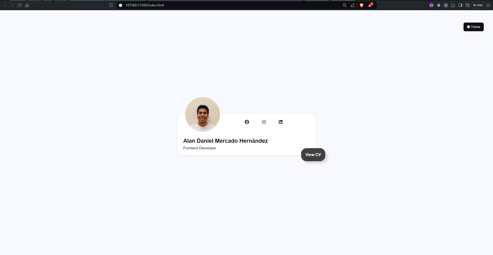
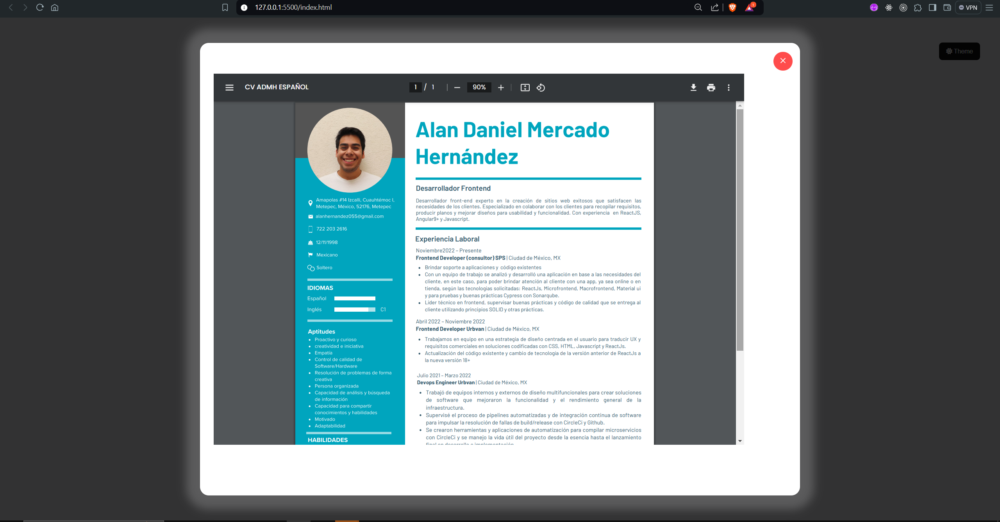
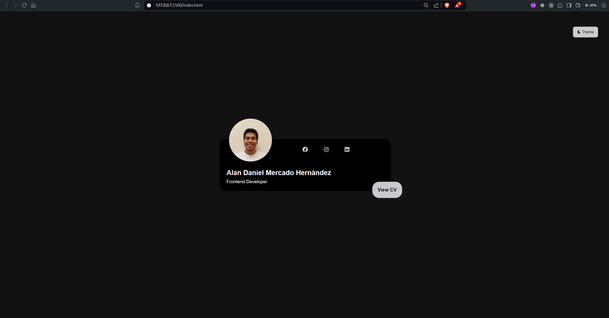
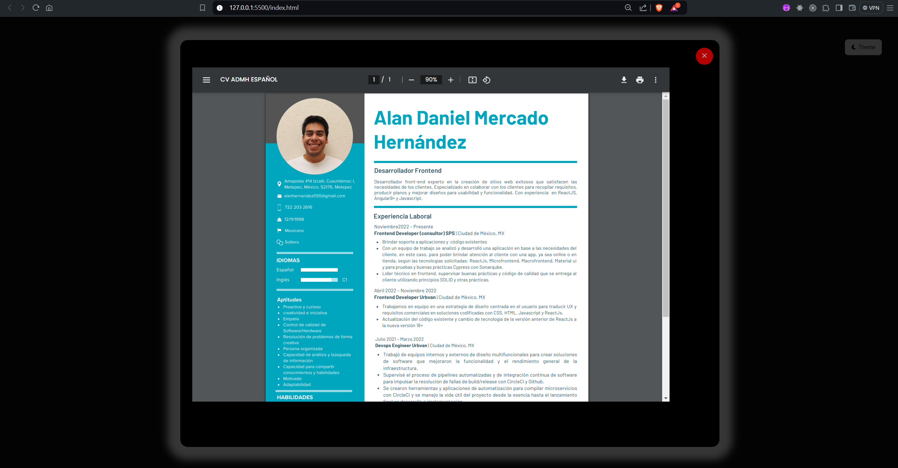

# Accenture Test Presentation

Proyecto hecho sobre html, css y javascript puro (Vanilla.js)


## Run Locally

Clona el proyecto

```bash
  git clone https://github.com/alandanielmh/accenture-text-presentation.git
```

ve a la caprtea o directorio del proyecto

```bash
  cd nombre de directorio donde se clono
```


Start the server

```bash
  instala la extensión Live Server en Visual Studio Code y sobre el html 
  da click derecho y selecciona la opción abrir con live server u Open with Live server
```

## Color Reference

| Color             | Hex                                                                |
| ----------------- | ------------------------------------------------------------------ |
| light-bg |  #F8F8FF |
| light-color |  #111111 |
| light-color-lighted |  #333333 |
| light-color-text |  #262626 |
| light-color-card |  #ffffff |
| dark-bg |  #111111 |
| dark-color |  #F8F8FF |
| dark-color-lighted |  #CCCCCC |
|dark-color-text |  #E8E8E8 |
| dark-color-card |  #000000 |


## Authors

- [Alan Daniel Mercado Hernández - @alandanielmh](https://github.com/alandanielmh/)


## Image/Examples




